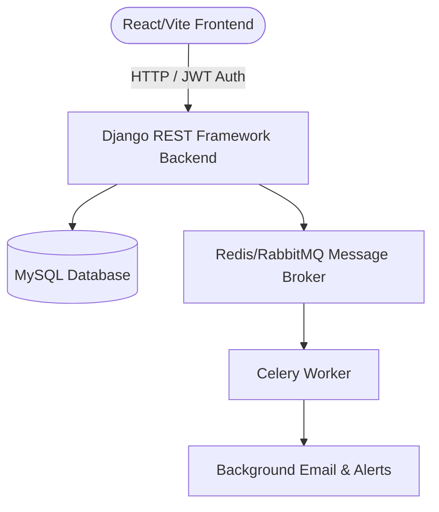

# 🚀 SaaS Employee Task Management & Collaboration Platform

A modern, multi-tenant **Software-as-a-Service (SaaS)** platform designed for organizations to manage departments, teams, projects, and task lifecycles. It includes granular role-based permissions, automated notifications, background processing, and built-in subscription plan/feature limit controls.

---

## 📋 Table of Contents
1. [Objective & Key Features](#-objective--key-features)
2. [Project Architecture](#-project-architecture)
3. [Tech Stack & Packages](#-tech-stack--packages)
4. [Folder Structure](#-folder-structure)
5. [Step-by-Step Setup Guide](#-step-by-step-setup-guide)
    - [Option A: Running with Docker Compose (Recommended)](#option-a-running-with-docker-compose-recommended)
    - [Option B: Running Natively / inside WSL](#option-b-running-natively--inside-wsl)
6. [API & Services Access](#-api--services-access)

---

## 🎯 Objective & Key Features

The primary goal of this application is to provide businesses with a highly organized, secure, and scalable environment to manage tasks, collaborate in teams, and track project metrics.

### Key Use Cases
* **Multi-Tenant Isolation**: Organizations sign up, manage their own departments, teams, and members securely isolated from other organizations.
* **Role-Based Access Control (RBAC)**: Supports roles with hierarchical access levels:
  * 👑 **Admin**: Manages organizational settings, departments, and plans.
  * 👔 **Manager**: Runs departments/teams, creates projects, and assigns tasks.
  * 👤 **Employee**: Views assigned tasks, updates progress, adds comments, and uploads attachments.
* **Subscription & Usage Management**: Enforces limits on active users, projects, storage, and tasks based on subscription plans (Free, Starter, Professional, Enterprise). Payment/billing is ready via Razorpay integration.
* **Department & Team Hierarchy**: Teams belong to parent departments, with users optionally assigned as Team Leads.
* **Task Lifecycle & Collaboration**: Custom task priority (Low to Urgent), status flows (To Do $\rightarrow$ In Progress $\rightarrow$ In Review $\rightarrow$ Done), commenting system, and attachment support.

---

## 🏗️ Project Architecture

This application follows a decoupled client-server architecture:



### Multi-Tenancy Design
Data is scoped globally by `Organisation`. When a request is made, a custom Django middleware resolves the user's active tenant (`Organisation`) to enforce resource isolation and subscription limits dynamically.

---

## 🛠️ Tech Stack & Packages

### Backend (Python & Django REST Framework)
* **Core Framework**: `Django 6.0` & `Django REST Framework`
* **Authentication**: `djangorestframework-simplejwt` (JSON Web Token authentication)
* **Background Tasks**: `celery` & `kombu`
* **Database Driver**: `mysqlclient`
* **File Uploads**: `pillow` (for avatars and attachments)
* **Settings & Environment**: `python-decouple`, `python-dotenv`

### Frontend (React & Vite)
* **Build System**: `Vite` (React)
* **Styling**: `Tailwind CSS v4`
* **HTTP Client**: `axios` (with JWT interceptors)
* **Icons**: `lucide-react`
* **Routing**: `react-router-dom`
* **Data Visualization**: `recharts` (for task progress & performance graphs)

---

## 📁 Folder Structure

```text
├── Backend/
│   └── employee_tasks_saas/       # Django Root
│       ├── employee_tasks_saas/   # Project configuration & settings
│       ├── users/                 # Custom user models & RBAC logic
│       ├── teams/                 # Departments & sub-team structures
│       ├── projects/              # Projects grouping task items
│       ├── tasks/                 # Task workflow, attachments, & comments
│       ├── subscription/          # Tenants, plans, billing, & Razorpay integration
│       └── notifications/         # Notification queues
│
├── Frontend/
│   ├── src/
│   │   ├── components/            # Reusable UI controls (Modals, Forms)
│   │   ├── context/               # Global state (Auth, UI theme)
│   │   ├── pages/                 # Full pages (Dashboards, Teams, Projects)
│   │   └── utils/                 # Axios configuration and API helper wrappers
│   └── package.json
│
├── Dockerfile                     # Django Backend container specification
└── docker-compose.yml             # Orchestration for Database & Django Services
```

---

## 🚀 Step-by-Step Setup Guide

### Option A: Running with Docker Compose (Recommended)
This is the easiest path, as it configures and compiles all requirements inside isolated containers automatically.

#### 1. Prerequisites
Ensure you have [Docker Desktop](https://www.docker.com/products/docker-desktop/) installed and running.

#### 2. Environment Configuration
Create a `.env` file in `Backend/employee_tasks_saas/employee_tasks_saas/` (or check if one exists) with these contents:
```env
SECRET_KEY=your-django-secret-key
DEBUG=True
ALLOWED_HOSTS=localhost,127.0.0.1

DB_ENGINE=django.db.backends.mysql
DB_NAME=saas_db
DB_USER=saas_user
DB_PASSWORD=Strongest@
DB_HOST=db
DB_PORT=3306
```

#### 3. Build and Start the Containers
Open your terminal in the project root directory and run:
```bash
# Build and run containers in detached mode
docker compose up -d --build
```
This builds your Django backend container (installing required dependencies like compiling mysqlclient and cryptography) and boots up the MySQL database container.

#### 4. Run Migrations
Initialize your database schemas inside the backend container:
```bash
docker compose exec web python manage.py migrate
```

#### 5. Start the Frontend Dev Server
Run the React frontend server locally on your host machine:
```bash
cd Frontend
cmd /c npm install     # Bypasses Windows script execution policy restrictions
cmd /c npm run dev
```

---

### Option B: Running Natively / inside WSL
If you prefer running the code directly on your machine:

#### 1. Setup Database
Start a local MySQL server and create a database named `saas_db`. Update the credentials in `Backend/employee_tasks_saas/employee_tasks_saas/.env` to point to your local port (usually `3306`).

#### 2. Backend Setup
```bash
# Navigate to backend directory
cd Backend/employee_tasks_saas

# Create and activate virtual environment
python -m venv .venv
# On Windows PowerShell:
.venv\Scripts\Activate.ps1
# On macOS/Linux/WSL:
source .venv/bin/activate

# Install requirements
pip install -r requirements.txt

# Run migrations and start server
python manage.py migrate
python manage.py runserver
```

#### 3. Frontend Setup
```bash
# Navigate to frontend directory
cd Frontend

# Install packages
npm install

# Start Vite dev server
npm run dev
```

---

## 🔗 API & Services Access

Once started, the following local URLs will be active:

| Service | Access Link | Description |
|---|---|---|
| **Frontend Application** | [http://localhost:5173](http://localhost:5173) | User UI / Dashboards |
| **Backend API Gateway** | [http://localhost:8000](http://localhost:8000) | REST API endpoints |
| **Django Admin Panel** | [http://localhost:8000/admin/](http://localhost:8000/admin/) | System Admin Database View |
| **MySQL Host Port** | `127.0.0.1:3307` | Remote database mapping port |
